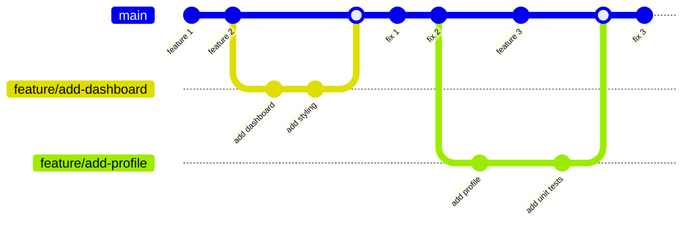
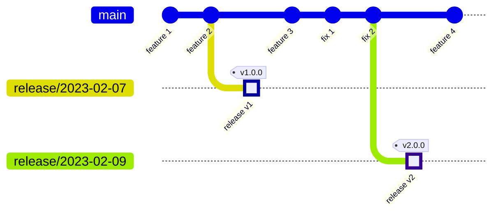

As someone who has been involved in web development for years, I've had my fair share of experiences with different branching strategies.
Over time, I've grown to prefer trunk-based development (TBD) for its simplicity and alignment with continuous deployment, especially when compared to the more traditional Git Flow model.

Before delving into why I prefer this approach, let's quickly recap the main difference between TBD and Git Flow.[^1]

## TBD vs. Git Flow

Trunk-based development traditionally involves developers working directly on the main trunk branch. In contrast, the variant I advocate for utilizes short-lived feature branches for pull requests before merging them frequently back into the trunk. This variant is sometimes, confusingly, equated with [GitHub Flow](https://docs.github.com/en/get-started/quickstart/github-flow).

Git Flow, in contrast, involves multiple branches (feature, develop, release, hotfix), each serving a specific stage in the development cycle. This model suits environments where releases are less frequent.

## Appeal of trunk-based development

What draws me to TBD is its straightforward approach. Here’s why I find it effective:

- One source of truth: With only one branch that represents the latest state of the codebase, there’s no confusion about which branch is the most up-to-date.
- Simplified workflow: Fewer branches translate to less complexity. It makes the workflow more manageable, especially for new team members. It also reduces the risk of merge conflicts.
- Quick integration: Merging changes frequently into the trunk means you can integrate and test new features more rapidly. There's always only one version of the codebase to test & integrate with.

This is not just based on my personal experience. Nicole Forsgren notes in her book [Accelerate: The Science of Lean Software and DevOps](accelerate-reading-notes) that teams do better in terms of deployment frequency, lead time, and mean time to recovery.

> Our research also found that developing off trunk/master rather than on long-lived feature branches was correlated with higher delivery performance. Teams that did well had fewer than three active branches at any time, their branches had very short lifetimes (less than a day) before being merged into trunk and never had “code freeze” or stabilization periods. It’s worth re-emphasizing that these results are independent of team size, organization size, or industry.

## Overcoming resistance

Initially, I was hesitant about trunk-based development (TBD), finding it disruptive to my usual workflow which involved aligning branches with specific environments. However, after our tech lead introduced it and we began working in this new way, my perspective shifted. I quickly recognized the benefits, such as reduced complexity and faster processes, that came from moving away from multiple long-lived branches.

At first, our team was scared by the fact that every pull request we merged automatically landed on the main branch and that our tech lead said we had to make sure the code was always in a releasable state. This was a stark departure from the safety net we felt with Git Flow, where multiple branches provided a cushion before hitting production. The notion of having every change be potentially release-ready brought a new level of accountability and focus to our work.

## Feature toggles

Another thing that may seem impractical is building large features or doing complex refactors that could take weeks to complete. How is that possible with short-lived branches, while still keeping the main branch in a releasable state? The answer lies in the concept of feature toggles.

Feature toggles, also known as feature flags, let you merge partial or incomplete features into the main branch without disrupting the user experience. By wrapping new functionalities in these toggles, you deploy them turned 'off' and then activate them when ready. This approach gives you the flexibility to continuously integrate and test changes in a live environment, without exposing them to end-users prematurely.

The adoption of feature toggles requires a shift in mindset. You have to plan development in a way that allows incremental changes and think ahead about how features could be toggled on and off. This planning approach aims to result in more modular and adaptable code, although achieving this can be challenging.

## Immature projects

Not every development team is at a stage where they can reliably maintain the main branch in a releasable state. Sometimes there is limited or no testing capacity, sometimes there are no automated tests yet. These shortcomings can be overcome by being pragmatic about trunk-based development (TBD). As a team, you can choose to first create a release branch from the trunk every time you're ready for a release.

This approach serves as a middle ground, especially for teams in the transition phase or those still developing their testing infrastructure. By branching off a release branch, teams can have a buffer zone for final testing and polishing without compromising the main branch's integrity. This step provides a safety net for performing additional checks and balances that are not yet integrated into the daily development workflow.

It's good to take into account that any new commits should still land on the main trunk first and should then be cherry-picked to the release branch. The [excellent website on trunk-based development](https://trunkbaseddevelopment.com/) explains in great detail the different approaches teams can take here. This way developers can mix and match the different branching strategies depending on the maturity level of their CI/CD setup.

## Conclusion

In conclusion, my evolution as a web developer, from a Git Flow enthusiast to a staunch advocate of trunk-based development (TBD), has been a journey of adapting to a more dynamic and streamlined workflow. Initially hesitant, I've come to appreciate the clarity and simplicity of TBD. This shift has not only refined the development practices of the teams I was in but also instilled a mindset geared towards continuous, incremental improvement.

Trunk-based development, in my experience, represents more than just a branching strategy; it's a reflection of a modern, responsive approach to software development.

## Summary of Pros and Cons

### Pros

- Simplified Workflow
- Quicker Integration
- Single Source of Truth
- Aligns well with continuous deployment

### Cons

- Requires strong CI/CD infrastructure
- Requires a cultural shift
- Feature toggles can be challenging to implement

## Some practical examples

Developing new features on short-lived feature branches works like this:

- git checkout -b `feature/abc`
- create a PR for review
- make sure all code is in a releasable state
- merge to `main` → deployment to development

### Deploying a new release

- create a branch on remote `release/2022-09-22`
- CI/CD triggers deploy to acceptance
- tag commit on the release branch → deployment to development

In a diagram this would look like:

[^1]: The concept of Git Flow was originally introduced in the blog post [A successful Git branching model](https://nvie.com/posts/a-successful-git-branching-model/) by Vincent Driessen. His diagram of Git Flow has since then been shared countless times with many teams and on many corporate websites. In 2020 Vincent added a comment that Git Flow is not for everyone, especially when a team is doing continuous deployment.
